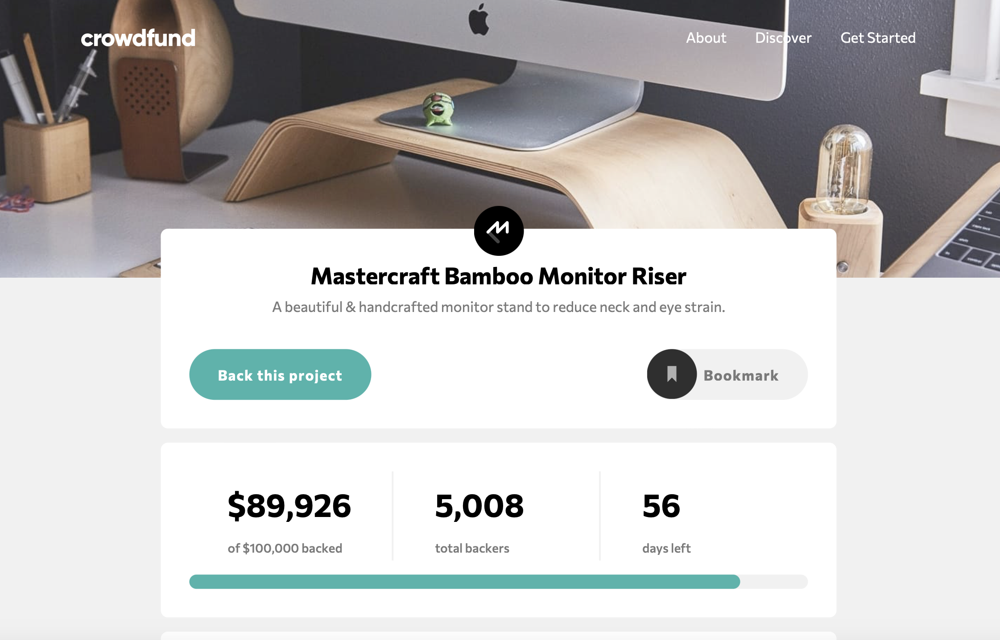
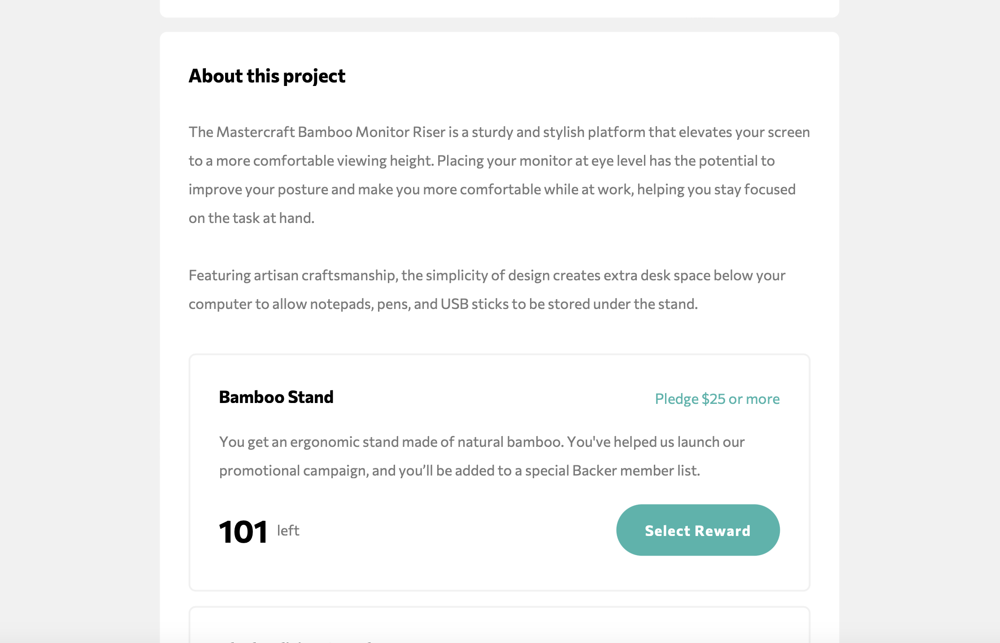
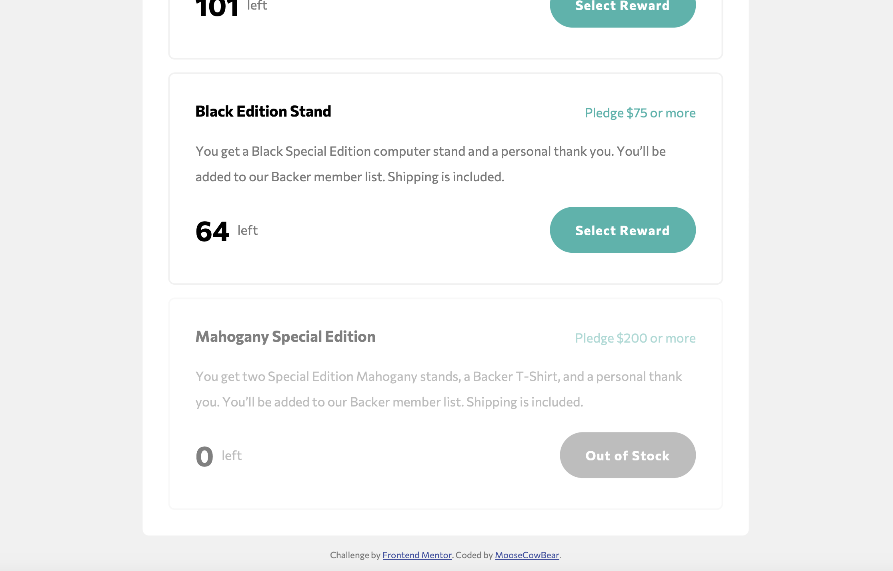

# Frontend Mentor - Crowdfunding product page solution

This is a solution to the [Crowdfunding product page challenge on Frontend Mentor](https://www.frontendmentor.io/challenges/crowdfunding-product-page-7uvcZe7ZR).

## The challenge

Users should be able to:

- View the optimal layout depending on their device's screen size
- See hover states for interactive elements
- Make a selection of which pledge to make
- See an updated progress bar and total money raised based on their pledge total after confirming a pledge
- See the number of total backers increment by one after confirming a pledge
- Toggle whether or not the product is bookmarked

## Screenshots

## Links

- [Solution](https://github.com/MooseCowBear/frontend-mentor-crowdfunding-product-page)
- [Live](https://moosecowbear.github.io/frontend-mentor-crowdfunding-product-page)

## Built with

- CSS custom properties
- CSS Grid
- Flexbox

## Author

- GitHub - [MooseCowBear](https://github.com/MooseCowBear)
- Frontend Mentor - [@MooseCowBear](https://www.frontendmentor.io/profile/MooseCowBear)